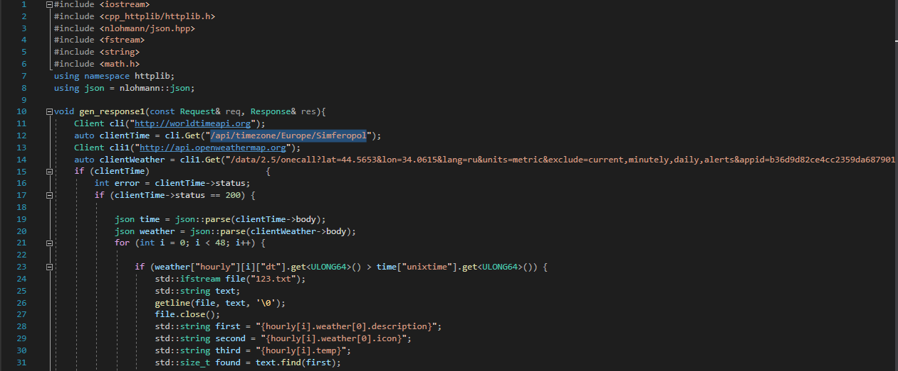
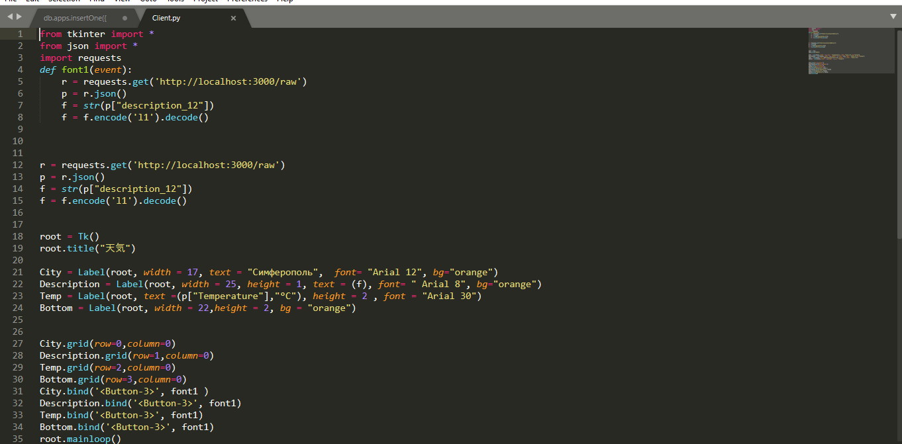

МИНИСТЕРСТВО НАУКИ  И ВЫСШЕГО ОБРАЗОВАНИЯ РОССИЙСКОЙ ФЕДЕРАЦИИ 
Федеральное государственное автономное образовательное учреждение высшего образования 
"КРЫМСКИЙ ФЕДЕРАЛЬНЫЙ УНИВЕРСИТЕТ им. В. И. ВЕРНАДСКОГО" 
ФИЗИКО-ТЕХНИЧЕСКИЙ ИНСТИТУТ 
Кафедра компьютерной инженерии и моделирования

 
<h3 align="center">Отчёт по лабораторной работе № 1  по дисциплине "Программирование"</h3>
  

студента 1 курса группы ПИ-б-о-201(2) 
Долгий Сергей Григорьевич 
направления подготовки 09.03.04 "Программная инженерия"

  
<table>
<tr><td>Научный руководитель  старший преподаватель кафедры  компьютерной инженерии и моделирования</td>
<td>(оценка)</td>
<td>Чабанов В.В.</td>
</tr>
</table>
  

Симферополь, 2020

<h3> Цель работы:</h3> 
1.Закрепить навыки разработки многофайловыx приложений; 
2.Изучить способы работы с API web-сервиса; 
3.Изучить процесс сериализации/десериализации данных в/из json; 
4.Получить базовое представление о сетевом взаимодействии приложений; 
<h3> Постановка задачи</h3> 
Разработать сервис предоставляющий данные о погоде в городе Симферополе на момент запроса.  В качестве источника данных о погоде используйте:
http://openweathermap.org. В состав сервиса входит: серверное приложение на языке С++ и клиентское приложение на языке Python. 
Серверное приложение (далее Сервер) предназначенное для обслуживания клиентских приложений и минимизации количества запросов к сервису openweathermap.org. Сервер должен обеспечивать возможность получения данных в формате JSON и виде html виджета (для вставки виджета на страницу будет использоваться iframe). 
Клиентское приложение должно иметь графический интерфейс отображающий сведения о погоде и возможность обновления данных по требованию пользователя. 
<h3> Ход работы:</h3> 

Для начала необходимо получить  API ключ на сайте http://openweathermap.org. Ключ(default):b36d9d82ce4cc2359da6879016f3f61f. Также получаем дополнительные ключи для закрепления. 

Рис.1 Полученные ключи 

После полученния Api ключа, проводим наш первый запрос и узнаем состояние погоды города Сиферополь на ближайшие два дня(по часам).Запрос:http://api.openweathermap.org/data/2.5/onecalllat=44.5653&lon=34.0615&lang=ru&units=metric&exclude=current,minutely,daily,alerts&appid=b36d9d82ce4cc2359da6879016f3f61f

Рис.2 Запрос на http://api.openweathermap.org  

Дальше используем сервис http://worldtimeapi.org для того, чтобы узнать точное время. Для этого проводим запрос http://worldtimeapi.org/api/timezone/Europe/Simferopol.

Рис.3 Запрос на http://worldtimeapi.org  

  После изучения предложенного материала,переходим к разработке серверного приложения (далее Сервер). Сервер состоит из трех функций, так как Сервер должен уметь отвечать на два запроса "/"(Отве в виде виджета), а также "/raw"(Ответ в формате JSON). Первая функция отвечает на запрос "/",  в теле функции прописываем два get запроса, на сервисы  http://worldtimeapi.org и http://api.openweathermap.org. Затем проверяем на ошибки. Наша задача сравнить время указанное  в ответах. Так как оба ответа представлены в фомате JSON, то мы парсим тела ответов в переменные JSON.(Заранее подключили все необходимые библиотеки, указанные в лабораторной работе.) Обращаемся к ключам(в нашем случае это ["hourly"][i]["dt] и ["unixtime]) и сравгиваем их, чтобы узнать, не устарели ли наи данные. После проверки переходим к к открытию заранее скаченного шаблона виджета. Считываем его в новую переменную, указываем тип string. Переходи к поиску и замене параметров, отвечающие за температуру и состояние погоды. Для этого используем функции find и replace. Заменяем строчки {hourly[i].weather[0].description}, {hourly[i].weather[0].icon}, {hourly[i].temp}, на значения из заранее полученного ответа JSON фотмата, по ключам(заменяемые строчки имееют названее ключей). Затем преобразуем числовые типы данных, в типы string, с помощью функции to_string. С помощью set_content, передаеи в ответ ввиде пеменной, где мы и производили описанные выше действия, в формате text/html. Следующая функция отвечает на зарос "/raw". Там иы также проводим запросы на сервисы, парсим ответы и проверяем устаревшие данные. Отличее от первой функции заключает в формате ответа, где Сервер должен выдать JSON. Для этого отбъявляем новый json и инициализируем в нем два ключа: "Temperature" и "description_12". В них передаем значения из полученного JSONа. В ответ на запрос передаем новый json. И основная функция main, служит для запуска Сервера.

Рис.4 Первая часть кода Сервера  

.png)

Рис.5 Вторая часть кода Сервера  
 
.png)

Рис.6 Третья часть кода Сервера  

Рис.7 Виджет  

  После изучения предоставленного материала переходим к разработке клиентского приложения(далее КП). По условию задания КП должно иметь графический интресфейс,шаблон предоставлен в задании. Созданем три поля с помощью команд Label. В первом содержиться название города и состояния погоды. Название города можно указать в ручную, а вот состояние погоды мы будем получать с ранее созданного серверного приложения(далее Сервера). Запрос будет оканчиваться на "/raw", поэтому ответ будет в JSON формате(все необходимые библиотеки подключены заранее). В первое поле будет идти значение от ключа "description_12",которое и отвечает за состояние погоды,записваем его в отдельную переменную и меняем тип на string.Здесь полученные данные выводятся в неправильной кодировке, поэтому воспользуемся командой "тут корявый текст".encode('l1').decode()". Во втором поле указывается температура. Используем значение от ключа "Temperature", а также прописываем "°C". Для оформления пользуемся командой grind, которая оформляет наш КП, как таблицу со строчками и столбцами. Для взаимодействия пользователя и КП используем команду команду bind. Функция записанная в эту команду, вызвает повторный запрос на сервер и обновляет данные.
  

Рис.8 Готовое КП 

Рис.9 Код КП 

<h3>Вывод</h3> 
В ходе проведения лабораторной работы, было разработано клиент-серверное приложение(далее КСП). Для написания КСП предварительно были изучены библиотеки С++: json и cpp-httplib(и скачаны с указанных ссылок), у Python были изучены: json и Tkinter. Были выработаны базовые навыки создания get запросов, обработки JSON объектов и создания графических интерфейсов. Также были закреплены базовые навыки разработки многофайловых приложений.

<h3>Каталоги</h3> 
[C++](./C++)
