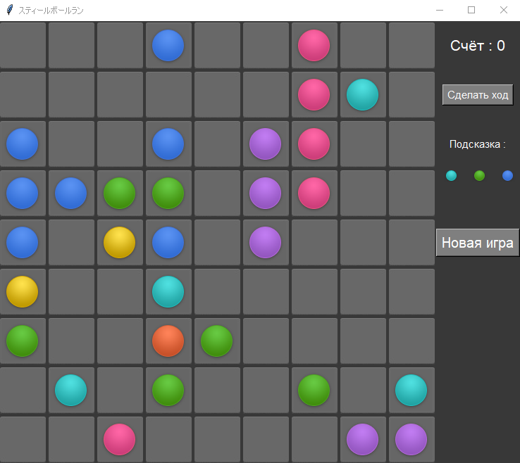

МИНИСТЕРСТВО НАУКИ  И ВЫСШЕГО ОБРАЗОВАНИЯ РОССИЙСКОЙ ФЕДЕРАЦИИ 
Федеральное государственное автономное образовательное учреждение высшего образования 
"КРЫМСКИЙ ФЕДЕРАЛЬНЫЙ УНИВЕРСИТЕТ им. В. И. ВЕРНАДСКОГО" 
ФИЗИКО-ТЕХНИЧЕСКИЙ ИНСТИТУТ 
Кафедра компьютерной инженерии и моделирования

 
<h3 align="center">Отчёт по лабораторной работе № 3  по дисциплине "Программирование"</h3>
  

студента 1 курса группы ПИ-б-о-201(2) 
Долгий Сергей Григорьевич 
направления подготовки 09.03.04 "Программная инженерия"

  
<table>
<tr><td>Научный руководитель  старший преподаватель кафедры  компьютерной инженерии и моделирования</td>
<td>(оценка)</td>
<td>Чабанов В.В.</td>
</tr>
</table>
  

Симферополь, 2020

<h3> Цель работы:</h3> 
1.Закрепить навыки разработки программ с простым графическим интерфейсом пользователя на зыке Python при помощи библиотеки Tkinter. 
2.Получить представление о разработке простых игровых приложений. 
<h3> Постановка задачи</h3> 
1.Используя стандартный модуль для разработки программ с графическим интерфейсом Tkinter реализуйте игру Lines на зыке Python. 
2.В качестве образца графического интерфейса используйте данную игру. 
<h3> Выполнение работы:</h3> 
Для начала заходим в консоль и прописываем команду: pip install --upgrade Pillow. После установки, переходим непосредственно к написанию кода. Для удобства сразу же были 
были созданны переменные, в которых храняться фотографии. Для создания удобного интерфейса был использован упаковщик grid, который позволяет расположить эелементы подобно таблице.
Была создана пара кнопок:"Новая игра" и "Сделать ход". Которые и работают согласно своим названиям, для каждой кнопки были прописаны функции. Для внутреигровых ситуации были 
созданы функции, которые отвечают за то или иное событие в игре, например удаление 5 шаров одинакового цвета в линию, перенос шара и т.д. 

Рис.1 Интерфейс  

