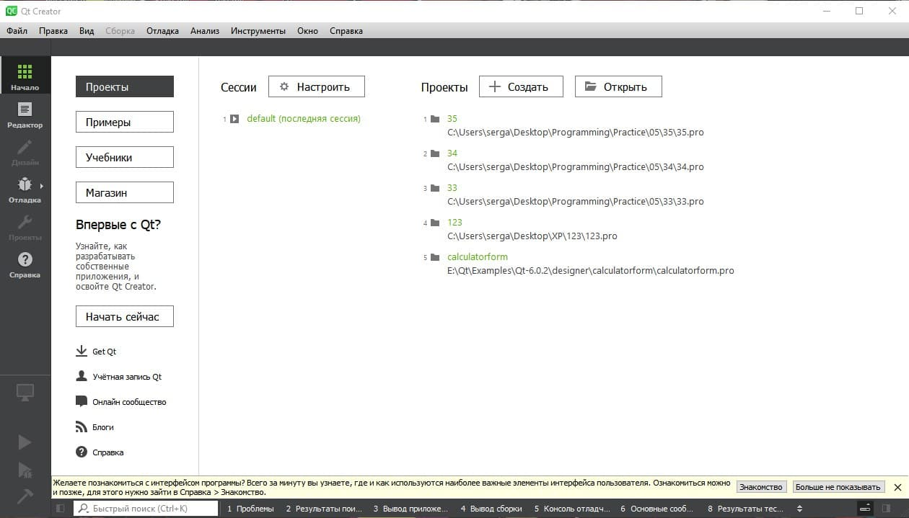
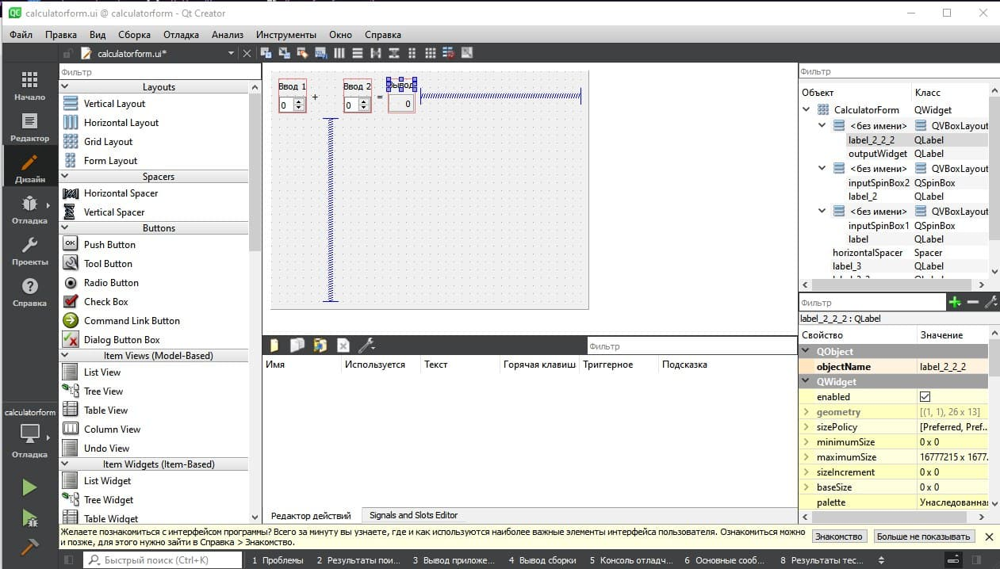

МИНИСТЕРСТВО НАУКИ  И ВЫСШЕГО ОБРАЗОВАНИЯ РОССИЙСКОЙ ФЕДЕРАЦИИ 
Федеральное государственное автономное образовательное учреждение высшего образования 
"КРЫМСКИЙ ФЕДЕРАЛЬНЫЙ УНИВЕРСИТЕТ им. В. И. ВЕРНАДСКОГО" 
ФИЗИКО-ТЕХНИЧЕСКИЙ ИНСТИТУТ 
Кафедра компьютерной инженерии и моделирования

 
<h3 align="center">Отчёт по лабораторной работе № 1  по дисциплине "Программирование"</h3>
  

студента 1 курса группы ПИ-б-о-201(2) 
Долгий Сергей Григорьевич 
направления подготовки 09.03.04 "Программная инженерия"

  
<table>
<tr><td>Научный руководитель  старший преподаватель кафедры  компьютерной инженерии и моделирования</td>
<td>(оценка)</td>
<td>Чабанов В.В.</td>
</tr>
</table>
  

Симферополь, 2020

<h3> Цель работы:</h3> 
1.Установить фреймворк Qt; 
2.Изучить основные возможности создания и отладки программ в IDE Qt Creator. 
<h3> Постановка задачи</h3> 
Настроить рабочее окружение, для разработки программного обеспечения при помощи Qt и IDE Qt Creator, а также изучить базовые возможности данного фреймворка.
<h3> Ход работы:</h3> 

Для начала проводим установку фреймворка Qt, для его дальнейшего использования. Заходим на официальный сайт и скачиваем, затем устанвливаем и выбираем версию MinGW 8.1.0 и QT 6.0.1.
Заходим и проверяем работоспособность фреймворка.

Рис.1 Интерфейс   

Затем редактируем проект-пример "Calculator Form Example, заменяем "Input 1", "Input 2", "Output" на "Ввод 1", "Ввод 2" и "Вывод" соответственно.

Рис.2 Замена в проекте-примере   

<h3>Задание 2</h3> 
1)Для того, чтобы изменить цветовую схему (оформление среды) необходимо зайди в параметры среды разработки (Главное меню - инструменты - параметры - тема/цвет) 
2)Закомментировать/раскомментировать блок кода возможно с помощью сочетаний клавиш CTRL+/ или с помощью соответствующего пункта контекстного меню Закомментировать/раскомментировать 
3)Чтобы открыть проводник с помощью средств QT, необходимо в окне "проекты" выбрать необходимый файл проекта и кликнуть ПКМ, затем выбрать пункт Показать в проводнике 
4)QT использует следующие расширения для файлов-проектов: .pro 
5)Чтобы запустить код без отладки необходимо нажать на кнопку Запустить или нажать Ctrl+R 
6)Чтобы начать код с отладкой необходимо нажать на кнопку Начать отладку запускающего проекта 
7)Чтобы установить/убрать брекпойнт необходимо кликнуть на необходимую строку слева от окна редактора или нажать клавишу F9 

<h3>Задание 3</h3> 
Чему равны переменные i и d в 6 строке? 
6 строка: d=1.0070165e-317, i=0 
Чему равны переменные i и d в 7 строкe? 
7 строка: d=1.0070165e-317, i=5 
Чему равны переменные i и d в 8 строке? 
8 строка: d=5, i=5 

<h3>Вывод</h3> 
В ходе выполнения лабораторной рабыто, я установил фреймворк Qt, изучил основные возможности создания и отладки программ в IDE Qt Creator.
